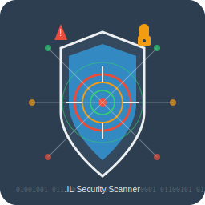

# Israeli Domain Security Scanner
ماسح الأمن الإلكتروني للدومينات الإسرائيلية



## نظرة عامة
أداة احترافية لمسح وتحليل الأمن الإلكتروني للدومينات الإسرائيلية، مخصصة لاكتشاف الثغرات الأمنية وتحليل البنية التحتية للويب الإسرائيلية.

## المميزات الرئيسية

### 🔍 قدرات المسح
- **اكتشاف الدومينات الإسرائيلية** - دعم كامل للنطاقات الإسرائيلية (.il, .co.il, .org.il, .gov.il)
- **مسح الثغرات الأمنية** - اكتشاف SQL Injection، XSS، LFI، Command Injection، SSRF
- **تحليل الشهادات الأمنية** - فحص SSL/TLS والبروتوكولات
- **البحث عن الملفات الحساسة** - اكتشاف الملفات والمسارات الحساسة

### 🌍 الدعم اللغوي
- **واجهة عربية كاملة** - دعم اللغة العربية في الواجهة الرسومية
- **تقارير متعددة اللغات** - إنشاء تقارير باللغة العربية والإنجليزية
- **واجهة سهلة الاستخدام** - تصميم حديث وسهل الاستخدام

### 📊 التقارير والتصدير
- **تقارير PDF احترافية**
- **تصدير إلى CSV وJSON**
- **تقارير HTML تفاعلية**
- **إحصائيات وتحليلات مفصلة**

## متطلبات النظام

### المتطلبات الأساسية
- Python 3.7 أو أحدث
- نظام تشغيل Windows/Linux/macOS
- اتصال إنترنت نشط
- مساحة قرص 100MB كحد أدنى

### المكتبات المطلوبة
جميع المكتبات المطلوبة مذكورة في ملف `requirements.txt`

## طريقة التثبيت

### الخطوة 1: تحميل الملفات
```bash
git clone https://github.com/SaudiLinux/israeli-domain-scanner.git
cd israeli-domain-scanner
```

### الخطوة 2: تثبيت Python
تأكد من تثبيت Python 3.7 أو أحدث:
```bash
python --version
```

### الخطوة 3: تثبيت المكتبات
```bash
# تثبيت جميع المكتبات المطلوبة
pip install -r requirements.txt

# أو استخدام pip3 على بعض الأنظمة
pip3 install -r requirements.txt
```

### الخطوة 4: التحقق من التثبيت
```bash
# اختبار الماسح الرئيسي
python IsraeliDomainScanner.py

# اختبار ماسح الثغرات
python vulnerability_scanner.py

# اختبار ماسح الدومينات
python domain_enumerator.py

# اختبار مولد التقارير
python report_generator.py
```

## طريقة الاستخدام

### الطريقة 1: الواجهة الرسومية (GUI)
```bash
# تشغيل الواجهة الرسومية
python IsraeliDomainScanner.py
```

#### خطوات الاستخدام:
1. أدخل الدومين الإسرائيلي المستهدف (مثال: example.co.il)
2. اختر خيارات المسح المطلوبة
3. اضغط "ابدأ المسح"
4. انتظر اكتمال المسح
5. تصدير النتائج بالصيغة المطلوبة

### الطريقة 2: سطر الأوامر (CLI)

#### مسح دومين واحد:
```bash
# مسح دومين واحد
python vulnerability_scanner.py --domain "target.co.il"
```

#### مسح عدة دومينات:
```bash
# مسح قائمة دومينات
python vulnerability_scanner.py --domains-list "israeli_domains.txt"
```

#### اكتشاف الدومينات:
```bash
# اكتشاف دومينات إسرائيلية
python domain_enumerator.py --keyword "mossad" --output "results.json"
```

#### توليد تقارير:
```bash
# توليد تقرير PDF
python report_generator.py --input "scan_results.json" --output "report.pdf" --format "pdf"

# توليد تقرير HTML
python report_generator.py --input "scan_results.json" --output "report.html" --format "html"
```

### الطريقة 3: تحليل الثغرات المتقدم

#### عرض الثغرات مع التفاصيل الكاملة:
```bash
# تحليل وتصور الثغرات بشكل مفصل
python display_vulnerabilities.py
```

#### تحليل ملف نتائج موجود:
```bash
# تحليل ملف نتائج JSON
python advanced_vulnerability_analyzer.py results.json
```

#### مسح شامل مع تحليل مفصل:
```bash
# مسح دومين مع تحليل مفصل للثغرات
python scanner_cli.py --domain "mossad.gov.il" --full-scan --detailed-analysis
```

## خيارات المسح المتقدمة

### خيارات المسح الأمني
- **مسح سريع**: فحص سطحي للثغرات الشائعة
- **مسح متوسط**: فحص شامل للثغرات المعروفة
- **مسح عميق**: فحص تفصيلي مع اختبارات متقدمة

### أنواع الثغرات المكتشفة
1. **SQL Injection** - حقن قواعد البيانات
2. **Cross-Site Scripting (XSS)** - سكريبتات عبر المواقع
3. **Local File Inclusion (LFI)** - تضمين الملفات المحلية
4. **Command Injection** - حقن الأوامر
5. **Server-Side Request Forgery (SSRF)** - تزوير الطلبات من الخادم
6. **Directory Traversal** - تجاوز المسارات
7. **SSL/TLS Issues** - مشاكل الشهادات الأمنية

## مثال على الاستخدام

### مثال 1: مسح دومين إسرائيلي
```python
# استيراد الماسح
from vulnerability_scanner import IsraeliVulnerabilityScanner

# إنشاء كائن الماسح
scanner = IsraeliVulnerabilityScanner()

# مسح الدومين
results = scanner.scan_domain("mossad.gov.il")

# عرض النتائج
print(f"تم العثور على {results['total_vulnerabilities']} ثغرة")
for vuln in results['vulnerabilities']:
    print(f"- {vuln['type']}: {vuln['description']}")
```

### مثال 2: اكتشاف دومينات
```python
# استيراد الماسح
from domain_enumerator import IsraeliDomainEnumerator

# إنشاء كائن الماسح
enumerator = IsraeliDomainEnumerator()

# اكتشاف دومينات
results = enumerator.enumerate_domains("idf")

# عرض النتائج
for domain in results['valid_domains']:
    print(f"دومين تم اكتشافه: {domain}")
```

### مثال 3: تحليل الثغرات المتقدم
```python
# استيراد أداة التحليل
from display_vulnerabilities import display_vulnerabilities

# عرض تحليل مفصل للثغرات
results = display_vulnerabilities()

# أو تحليل ملف نتائج موجود
import json
with open('scan_results.json', 'r') as f:
    scan_data = json.load(f)
    
# عرض ملخص الخطورة
critical_count = sum(1 for vuln in scan_data['vulnerabilities'] 
                     if vuln['severity'] == 'Critical')
print(f"عدد الثغرات الحرجة: {critical_count}")
```

### مثال 4: إنشاء تقرير تحليل متقدم
```bash
# تحليل الثغرات وعرضها بالعربية والإنجليزية
python display_vulnerabilities.py

# تحليل ملف نتائج محدد
python advanced_vulnerability_analyzer.py vulnerability_scan_20250922_191222.json
```

## التقارير والمخرجات

### أنواع التقارير المدعومة
- **PDF**: تقارير احترافية قابلة للطباعة
- **HTML**: تقارير تفاعلية مع رسوم بيانية
- **CSV**: بيانات جدولية للتحليل
- **JSON**: بيانات خام للمعالجة الآلية

### أدوات التحليل المتقدمة

#### 1. عارض الثغرات المتقدم (`display_vulnerabilities.py`)
- **عرض تفصيلي للثغرات** مع الأنواع والخطورة
- **دعم ثنائي اللغة** (العربية والإنجليزية)
- **CVSS Score** لكل ثغرة
- **إثباتات الاستغلال** وإرشادات الإصلاح
- **تقييم المخاطر الإجمالي**

#### 2. محلل الثغرات المتقدم (`advanced_vulnerability_analyzer.py`)
- **تحليل ملفات النتائج JSON**
- **تصنيف الثغرات حسب الخطورة**
- **توصيات أمان مخصصة**
- **إحصائيات مفصلة**

#### 3. واجهة سطر الأوامر المتقدمة (`scanner_cli.py`)
- **مسح سريع وفعال**
- **خيارات متقدمة للمسح**
- **تصدير تلقائي للتقارير**
- **دعم المسح الجماعي**

### محتوى التقارير
- ملخص عام للنتائج
- قائمة بالثغرات المصنفة حسب الخطورة
- إثباتات الاستغلال (Proof of Concept)
- توصيات الأمان
- إحصائيات مفصلة
- تحليل المخاطر
- خرائط الاختراق المقترحة

## النتائج والتفسير

### تصنيفات الخطورة
- **حرج (Critical)**: ثغرات خطيرة تسمح بالوصول الكامل
- **عالي (High)**: ثغرات خطيرة تتطلب إصلاحًا فوريًا
- **متوسط (Medium)**: ثغرات مهمة يجب إصلاحها
- **منخفض (Low)**: مشاكل بسيطة يُنصح بإصلاحها

### التوصيات
- قم بتحديث البرامج بانتظام
- استخدم معايير الأمان الحديثة
- راقب السجلات الأمنية
- نفذ اختبارات اختراق دورية

## استكشاف الأخطاء وإصلاحها

### المشاكل الشائعة

#### مشكلة 1: فشل تثبيت المكتبات
```bash
# حاول استخدام pip3 بدلاً من pip
pip3 install -r requirements.txt

# أو استخدام sudo (على Linux/Mac)
sudo pip3 install -r requirements.txt
```

#### مشكلة 2: فشل الاتصال بالدومين
```bash
# تحقق من اتصال الإنترنت
ping google.com

# تأكد من صحة الدومين المستهدف
nslookup target.co.il
```

#### مشكلة 3: أخطاء SSL/TLS
```bash
# قد تحتاج إلى تحديث شهادات SSL
pip install --upgrade certifi
```

## الأمان والمسؤولية

### التحذيرات القانونية
- **استخدم هذه الأداة فقط على الأنظمة التي تمتلك إذنًا باختبارها**
- **عدم استخدامها في أنشطة غير قانونية**
- **احترام قوانين الأمن الإلكتروني المحلية**
- **الحصول على تصاريح رسمية قبل الاختبار**

### أفضل الممارسات
- احصل على إذن خطي قبل الاختبار
- وثق جميع أنشطتك
- لا تسبب ضررًا بالأنظمة
- احتفظ بسرية البيانات الحساسة

## المساهمة في المشروع

نرحب بالمساهمات! يرجى اتباع الخطوات التالية:
1. انسخ المستودع (Fork)
2. أنشئ فرعًا جديدًا (Branch)
3. اجعل تغييراتك
4. اختبر التغييرات
5. أرسل طلب السحب (Pull Request)

## الترخيص
هذا المشروع مرخص تحت رخصة MIT. راجع ملف LICENSE للتفاصيل.

## الاتصال والدعم

### المؤلف
**SayerLinux**
- البريد الإلكتروني: SayerLinux1@gmail.com
- GitHub: [github.com/SayerLinux](https://github.com/SayerLinux)

### الدعم الفني
للحصول على الدعم الفني أو الإبلاغ عن المشاكل:
1. افتح issue على GitHub
2. أرسل بريدًا إلكترونيًا مع تفاصيل المشكلة
3. تضمن سجلات الأخطاء إن أمكن

## الشكر والتقدير
تم تطوير هذه الأداة لأغراض الأمن الإلكتروني والبحث الأكاديمي. نحث جميع المستخدمين على استخدامها بمسؤولية واحترام القوانين المحلية والدولية.

---

## الملفات الجديدة والمحدثة

### أدوات التحليل المتقدمة الجديدة:
- **`display_vulnerabilities.py`** - عارض الثغرات المتقدم مع دعم ثنائي اللغة
- **`advanced_vulnerability_analyzer.py`** - محلل متقدم لملفات النتائج JSON
- **`scanner_cli.py`** - واجهة سطر أوامر متقدمة للمسح السريع
- **`vulnerability_demo.py`** - عرض توضيحي للثغرات المكتشفة

### التحديثات الأخيرة:
- ✅ **دعم تحليل الثغرات المتقدم** مع CVSS Score
- ✅ **عرض تفصيلي للثغرات** بالعربية والإنجليزية
- ✅ **تصنيف الخطورة** (حرج، عالي، متوسط، منخفض)
- ✅ **إثباتات الاستغلال** وتوصيات الإصلاح
- ✅ **تقارير JSON تفاعلية** مع تحليل المخاطر

---

**⚠️ تحذير**: هذه الأداة مخصصة للاختبار الأمني المصرح به فقط. استخدامها في أنشطة غير قانونية يعرضك للمسؤولية القانونية.

**تم التطوير بواسطة SayerLinux - SayerLinux1@gmail.com**